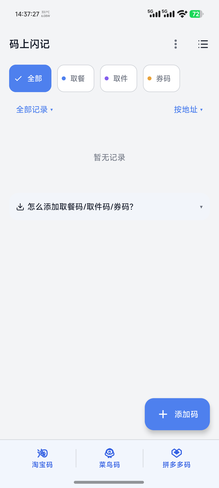
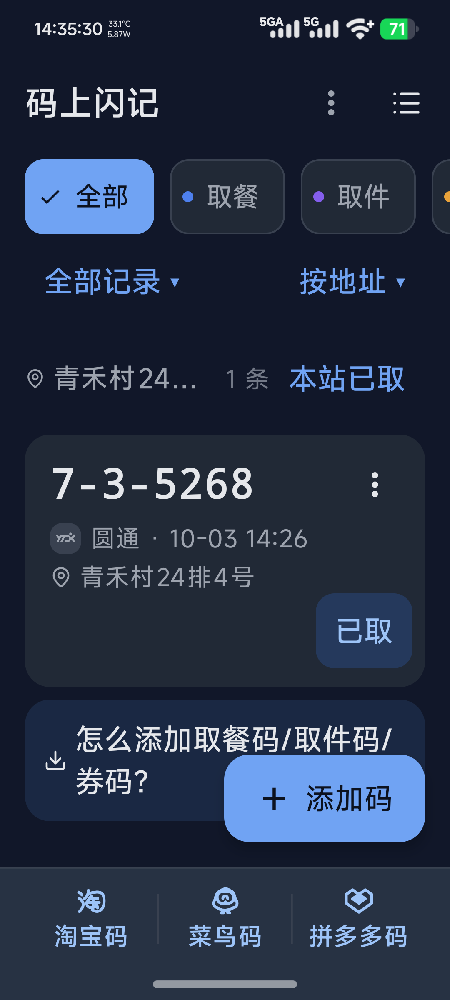
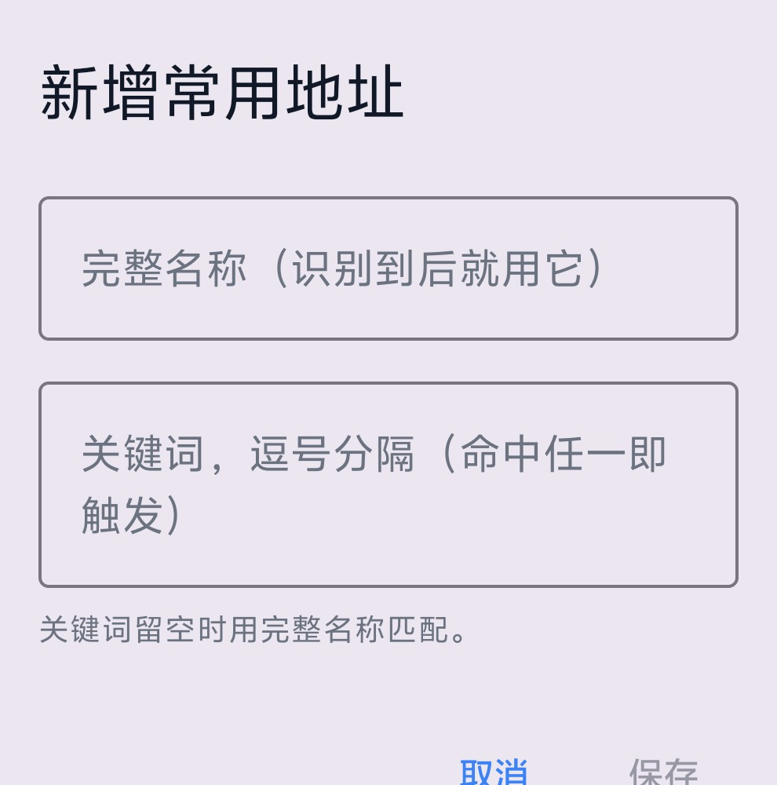

# 码上闪记

自动从短信、通知、截图和分享内容中提取取件码、取餐码及券码。打开应用即可查看、复制和标记已取，也能直接打开淘宝码、菜鸟码或拼多多码。

默认在本机识别和保存；离线中文 OCR 与二维码模型随安装包提供。AI、地图和快递查询均为可选功能，需要自行配置并开启。

[](https://github.com/chenran0408/pickup-code-app/actions/workflows/ci.yml)
[](https://github.com/chenran0408/pickup-code-app/releases)
[](https://github.com/chenran0408/pickup-code-app/releases/latest)

<div align="center">
  
  
</div>

截图中的取件码与地址为合成测试内容。

## v1.2.0 更新

- 取件短信格式扩展、验证码排除修复；可选识别默认短信应用和微信的新通知。
- 首页默认全部记录，已取历史保留并可恢复，支持已取/过期筛选与按站点批量已取。
- 码值点一下复制；淘宝、菜鸟、拼多多入口固定在紧凑底栏，三个点击区以竖线分隔。
- 统一深浅色主题、圆角与按钮，适配窄屏、大字体和键盘弹出布局。
- 后台完成排序/分组及设置解密；页面离开前台后暂停订阅与计时刷新。
- 仅提供 arm64，启用 R8、资源收缩和原生库压缩，保留离线识别模型。

变更与验证见 [更新说明](docs/UPDATE_1.2.0.md)，发布说明见 [Release](https://github.com/chenran0408/pickup-code-app/releases/latest)。

## 下载与安装

支持 Android 8.0 及以上的 arm64 手机。下载 [正式 APK](https://github.com/chenran0408/pickup-code-app/releases/latest/download/app-arm64-v8a-release.apk)，校验值见 Release 附件 `SHA256SUMS.txt`。

本 fork 从 v1.2.0 使用独立正式签名，后续版本沿用同一密钥。标准 Android 设备不能直接覆盖上游签名或调试签名的安装包；不要通过卸载旧包绕过签名校验，以免丢失本机记录。

## 快速开始

安装后先选择适合自己的识别方式，按需授权即可：

| 使用场景 | 操作 | 所需授权 |
|---|---|---|
| 普通取件短信 | 设置中开启短信自动识别 | 接收短信权限 |
| 网络短信 / 5G消息 / RCS | 开启“短信通知识别”，让默认短信应用显示带正文的新通知 | 系统通知访问权限 |
| 微信取件通知 | 开启微信通知识别，收到带正文的新通知 | 系统通知访问权限 |
| 淘宝 / 拼多多 / 京东取件通知 | 分别开启对应通知识别开关，通知中需包含码值 | 系统通知访问权限 |
| 截图或图片 | 在相册或其他应用里分享图片，选择“码上闪记” | 分享图片本身不需要无障碍或全量相册权限 |
| 屏幕上的取件码 | 开启无障碍服务，添加快捷磁贴，打开目标页面后点击磁贴 | 无障碍权限；系统截图接口需 Android 11及以上 |
| 已选中的文字 | 长按选中文字，在划词菜单中选择“码上闪记” | 无额外读取权限 |
| 手动添加 | 点首页右下方“添加码” | 无额外读取权限 |

识别后点击码值复制，点击卡片查看详情，点“标记已取”保留到已取历史；需要删除时打开记录菜单。底部三个入口直接跳转对应平台，具体落地页面取决于该平台版本。

分享单张图片后，应用显示识别进度与本次保存结果，可直接复制或查看详情；没有结果时可手动添加。开启 AI 时，本地结果先显示，AI 后台补充通过通知提醒。首页与详情页均显示当前状态，未取码保持醒目，已取记录降低视觉强调；“未取 · 已过期”仍表示没有取走。

在首页点右上角分享图标可导出当前未取的取件码和取餐码。复制分享文本后，点“添加码”→“导入剪贴板”，先核对码值、类型和地址，再点“确认导入”；也可以将整段文本粘贴到码值框，自动显示导入预览。平时在同一个框里输入单个码即可，短位数取餐码会自动选取餐类型。重复导入会跳过相同的活跃记录，不改动已有记录；旧版无类型标记的文本可在预览中修正取件/取餐类型。

通知访问权限与应用发送通知的权限是两回事。通知识别仅处理已开启的默认短信应用、微信、淘宝、拼多多和京东，不读取历史聊天或站内消息；没有新通知、正文被隐藏或只有汇总提示时无法识别。网络短信支持依赖通知正文，不能保证所有系统和聊天状态都能读到。真实微信新通知及最终短信接收仍需更多设备验证。

## 功能

### 核心识别
- **识别入口**：控制面板磁贴、无障碍自动扫描、分享菜单、短信自动识别、可选短信、微信及购物应用通知识别、划词识别、手动录入
- **智能 OCR**：ML Kit 中英文混合识别，自动归一化 Unicode 横杠变体
- **多格式覆盖**：三段式 (1-2-3456)、四段式 (A1-2-3-45)、字母前缀三段式 (A1-2-3456)、字母-数字 (D-12345)、长数字、带前缀的取件码等
- **上下文感知**：区分快递/餐饮场景，自动过滤干扰数字
- **AI 增强**：可选接入任意 OpenAI 兼容 API（默认 GPT-4o-mini，可改）；本地结果先保存并通知，AI 后台补充，冲突地址作为候选供核对
- **券码（二维码）识别**：检测屏幕/图片中的二维码，解码结果作为码值入库

- **通知识别**：短信通知仅处理默认短信应用；微信、淘宝、拼多多、京东只处理对应官方包名，五个开关独立且默认关闭。仅处理新通知可见正文，无通知/隐藏详情无法识别，不读取历史聊天。本地识别取件码和取餐码，不调用在线 AI。购物通知的标题与可见正文一起解析；仅物流更新、无码值或隐藏正文时无法识别。
- **规则管理**：内置和自定义提取规则可管理，对应名称反映当前支持的格式；上下文与校验的技术说明保留在开发文档中。

### 地址识别
- **预存地址优先**：把你常去的驿站/快递柜预先存好（**完整名称 + 关键词**），识别命中任一关键词时，
  直接用你录入的完整名称替换识别结果，而不是 OCR 抄下来的那行。关键词留空则用完整名称匹配。
  支持从历史记录一键导入、停用、删除；删除过的不会再被自动学回来。地址加密保存在本机。

  <div align="center">
    
  </div>

- **逐码窗口定位**：多条通知同屏时，按码所在的卡片窗口取地址，避免不同驿站之间串台
- **多策略管线**：显式标签 → 「到…取件」句式 → 号柜 → 管道分隔 → 兜底等 11 级策略，自动跨行拼接 OCR 拆断的地址
- **折叠地址补全**：收货/取件地址被 UI 折叠成短串时，自动用同屏更完整的街道地址替换
- **快递100 反向验证**：识别到运单号时调快递100 API 查取件码/地址作为标准答案，对照校验并补全地址

### 身份码
- **淘宝身份码 / 菜鸟出库码 / 拼多多身份码**：三个入口分开，各带品牌单色图标
- 入口位置：主页底部固定紧凑入口，三等分点击区域以竖线分隔；详情页文字入口和大卡片
- **三级降级**：直达深链 → 备用入口 → 打开对应 App 首页

### 来源识别
- **订单号前缀匹配**：JT→极兔、SF→顺丰、YT→圆通 等，优先于 OCR 文本
- **结构化定位**：品牌+快递/速递/物流后缀识别 + 方括号品牌 + 邻近行匹配
- **品牌图标**：识别到的来源显示对应品牌单色图标（快递、外卖、茶饮、餐饮共 24 个品牌），统一跟随主题色

### 记录列表
- 主页默认显示全部记录（含券码和已取历史），可筛选已取、过期，按时间或地址分组。
- 已填写地址的分组支持「本站已取」，确认后整组归档，可通过提示条撤销。
- 批量已取只操作本组可见的活跃记录；已取记录可恢复，不再随回收站自动删除。
- 「淘宝码」「菜鸟码」「拼多多码」三个紧凑入口固定在主页底部，直接打开对应平台，滚动清单时也可使用；详情页提供同样的入口。

### 数据管理
- **上下文去重**：结合订单/运单、地址、来源和时间合并；不同站点的同码保留，已取操作按记录执行
- **重复通知**：明确属于同一取件记录的重复识别合并更新，并推送记录更新提醒
- **稍后提醒**：通知栏一键稍后提醒，1 小时后重新推送，取件后自动取消
- **已取历史**：单独保留，可撤销或恢复；删除操作才进入回收站，24 小时后清理
- **识别反馈**：粘贴误识别/漏识别消息，生成可编辑的随机数字脱敏样例，人工确认后保存反馈文件
- **地图验证**：提取地址后自动调用地理编码验证真实性（支持高德 API）
- **截图治理**：删除记录时一并回收截图文件；启动时自动清理孤儿截图、超过 30 天的截图，并把截图目录控制在 50 MB 以内
- **回收站清理**：过期记录连同其截图一起删除

### 隐私
- **默认本地**：应用不提供云端记录同步，OCR、二维码及通知识别在本机完成
- **加密存储**：API Key 与常用取件地址经 AndroidKeyStore AES-GCM 加密后落盘
- **身份码页面不采集**：识别到身份码/出库码页面时不读取、不截图、不入库
- **网络功能可选**：AI、地图验证、快递100 反查默认关闭；开启后会将识别内容/图片、地址或运单信息发送到所配置的服务，请自行选择可信服务

### 自学习
- **自动模式发现**：从未识别的 OCR 文本中聚类分析，自动生成新正则并应用
- **用户反馈闭环**：详情页确认/标记错误，记录每个模式的准确率
- **统计面板**：总览命中率、模式分布、已学习规则、候选建议
- **识别成绩单**：一键生成统计卡片图片，分享给好友

## 验证与性能

293项单测与47/47识别语料通过；SQLite 6/7/8→9迁移、Debug/Release构建及 Lint 检查通过。真机检查包括图片 OCR、二维码、复制、已取恢复、删除菜单、键盘、深浅色、窄屏和大字体。

同机 ABBA 对照使用144条合成记录，两版均为启用 R8 的 Release，每版10次进程冷启动、6轮滚动：

| 指标 | UI优化前 | UI优化后 |
|---|---:|---:|
| 首帧耗时中位数 | 111ms | 113ms |
| 滚动P95中位数 | 16ms | 16ms |
| 滚动P99中位数 | 18ms | 18ms |
| legacy jank比例 | 0.925% | 0.945% |

这台设备上两版表现相近，未宣称明显提速。首帧测量保留文件缓存，不等于列表全部加载完成；不同首页布局、固定AOT与单设备样本限制见 [完整对照报告](docs/performance/CONTROLLED_1.2.0.md)。

## 技术栈

| 模块 | 技术 |
|------|------|
| UI | Jetpack Compose + Material3 |
| OCR | ML Kit Text Recognition (Chinese) |
| 截屏 | 无障碍服务 takeScreenshot |
| 外部接收 | Intent Filter (SEND / PROCESS_TEXT) |
| 触发 | Quick Settings Tile + 无障碍自动扫描 |
| 存储 | Room (SQLite) |
| 设置 | DataStore Preferences |
| 加密 | AndroidKeyStore AES-GCM（API Key、常用取件地址） |
| 身份码跳转 | Intent 深链 + Android 11 包可见性声明 (queries) |
| 地图 | Android Geocoder + 高德 API（可选） |
| 快递验证 | 快递100 API（可选） |
| AI | 可选接入任意 OpenAI 兼容 API（默认 GPT-4o-mini，支持修改 API 地址与密钥） |
| 自学习 | 本地聚类分析 + 自动正则生成 |

## 项目结构

```
app/src/main/java/com/pickupcode/app/
├── App.kt                 # Application：全局 scope、通知频道、启动时截图治理
├── MainActivity.kt        # 主页/历史列表/回收站/手动录入 + 导航
├── data/                  # 数据层：Room 实体 + DAO(去重/回收站/归档)
├── extractor/             # 识别核心
│   ├── CodeExtractor.kt        # 取件/取餐码 正则+评分+地址策略管线
│   ├── AddressExtractor.kt     # 地址识别：预存地址 → 逐码窗口 → 全屏多级策略
│   ├── SavedAddressMatcher.kt  # 预存地址匹配（纯函数，可单测）
│   ├── AIExtractor.kt          # OpenAI 兼容 AI 提取
│   └── CouponDetector.kt       # 券码(二维码)检测+解码
├── ocr/OCREngine.kt       # ML Kit 文本识别
├── learner/               # 自学习
│   ├── PatternLearner.kt       # 自动生成正则/统计
│   ├── CommonStationStore.kt   # 自动学习的常用站点（仅作"从历史导入"候选）
│   └── SavedAddressStore.kt    # 用户预存地址（加密存储）
├── util/                  # IdentityCodeLauncher(身份码跳转)、ScreenshotStore(截图治理)、SensitivePageGuard(身份码页面拒采)
├── geocoder/GeocoderVerifier.kt   # 地址地理编码验证
├── kuaidi100/Kuaidi100Verifier.kt # 快递100 运单反查
├── notification/          # 取餐/取件/券码通知 + 已取/忽略广播
├── preferences/           # 设置(DataStore) + SecretCipher(加解密)
├── service/               # 无障碍服务(截屏+识别)、快捷磁贴
├── share/ShareReceiver.kt # 外部分享/拖放
└── ui/                    # Compose UI：theme/components/screens
```

**识别流程**：`截图/分享 → OCR(文字) + 券码检测(二维码) + 正则/AI(取餐/取件码) → 合并去重(券码与食/件码互斥) → 地址识别(预存地址优先) → 存库 + 通知 → 地址验证/快递100反查`

## 取件码格式覆盖（支持自定义）

| 格式 | 示例 |
|------|------|
|二段式|`1-2345`|
| 三段式 | `1-2-3456`|
| 四段式 | `A1-2-3-45`|
| 字母前缀三段式 | `A1-2-3456`|
| 字母-横杠-数字 | `D-12345`|
| 字母+数字 (无横杠) | `D12345`|
| 长数字 (6-8位) | `123456` |
| 八位柜机码（4+4） | `6811-9770` |
| 带前缀 | `取件码：123456`|
| 餐饮 | `A12` `123`|

## 开发者

想从源码编译、贡献代码或报告问题？请查看：

- **[构建指南](docs/BUILDING.md)** —— 从源码编译（JDK 17 / Gradle 8.9 / Android SDK 要求、常见问题）
- **[贡献指南](CONTRIBUTING.md)** —— 如何提 Issue、提交 PR、代码规范
- **[识别语料回归](docs/CORPUS.md)** —— 用真实截图语料量化识别 precision/recall，如何采集新语料

## 许可证

[GPL-3.0](LICENSE)

界面与品牌图标的来源、署名及各自许可证见 **[ICONS.md](ICONS.md)**。

本项目 fork 自 [zixij644-elaborate/pickup-code-app](https://github.com/zixij644-elaborate/pickup-code-app)，保留原项目许可与作者归属。1.2.0 更新与验证见 [更新说明](docs/UPDATE_1.2.0.md)。
